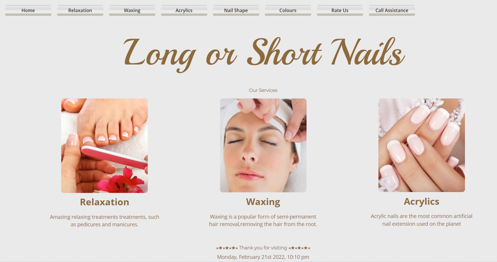
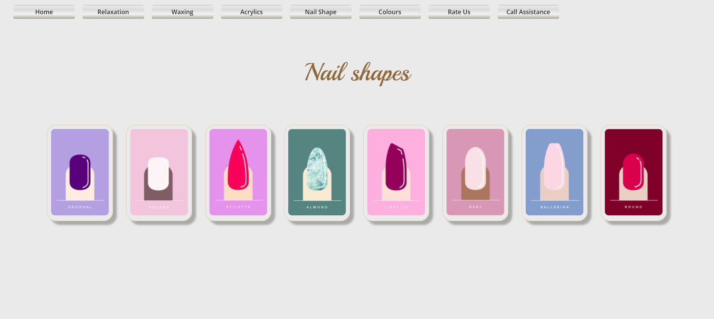
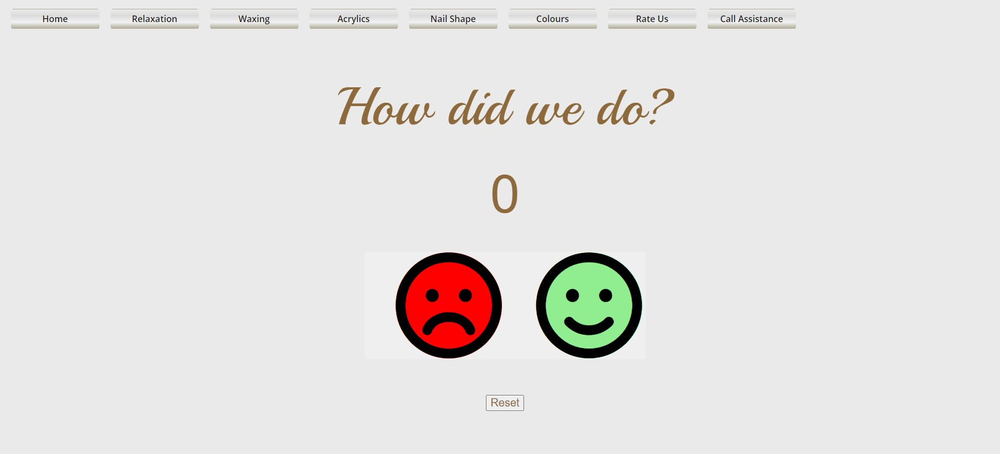

# Final Project - Long or Short Nails




Live Application Link 👀 ** https://longshortnail.herokuapp.com/ **

## **Table of Contents**  


  - [The Task](#the-task)
  - [User Story](#user-story)
  - [Description](#description)
  - [Images / Video](#images--video)
  - [Apps](#apps)
  - [Languages](#languages)
  - [Authors, Acknowledgement, & Resources 🤝](#authors-acknowledgement--resources-)
  - [License](#license)

---

## The Task
```
Build a performant and scalable MERN stack single-page application that fulfills a real-world need, with a focus on data and user demand.

Use React for the front end.

Use GraphQL with a Node.js and Express.js server.

Use MongoDB and the Mongoose ODM for the database.

Use queries and mutations.

Be deployed using Heroku (with data).

Have a polished UI.

Be responsive.

Be interactive (i.e., accept and respond to user input).

Include authentication (JWT).

Protect sensitive API key information on the server.

Have a clean repository that meets quality coding standards (file structure, naming conventions, best practices for class and id naming conventions, indentation, high-quality comments, etc.).

The application that was created was called Iso Meals; an e-commerce store for people that have been suddenly forced into isolation and may not feel well enough to do their own shopping. This application lets them pick the 'food bundle' of their choice, without having to find and select individual items.
```

## Description
```
An electronic display menu for a Nail Salon, displaying services and pricing.
A rate our service page and a call for assistance button
```

## User Story
```
AS AN business owner, 
I WANT an electronic menu that customers can peruse, to free up my staff
SO THAT the customer is aware of our services
``` 

## Images / Video



---

## Apps
*VS Code
*NodeJS
*Mongo Atlas
*Mongo Compass
*React
*NPM Packages
    *apollo-server-express
    *bcrypt  
    *dotenv
    *express
    *graphql
    *jsonwebtoken
    *moment
    *mongoose
    *react-moment
    *uifx
    *nodemon
    *@fortawesome/fontawesome-free
    *@fortawesome/react-fontawesome
    *@bootstrap-react
```

## Languages
```
JavaScript
CSS
HTML
```

## Authors, Acknowledgement, & Resources 🤝

```
Teaching Crew at UniSA Coding Bootcamp 🎉
Bootcamp collegues
W3Schools 
GitHub 
Youtube
Google
StackOverflow
```

## License

  [MIT](https://opensource.org/licenses/MIT/)
  ---
